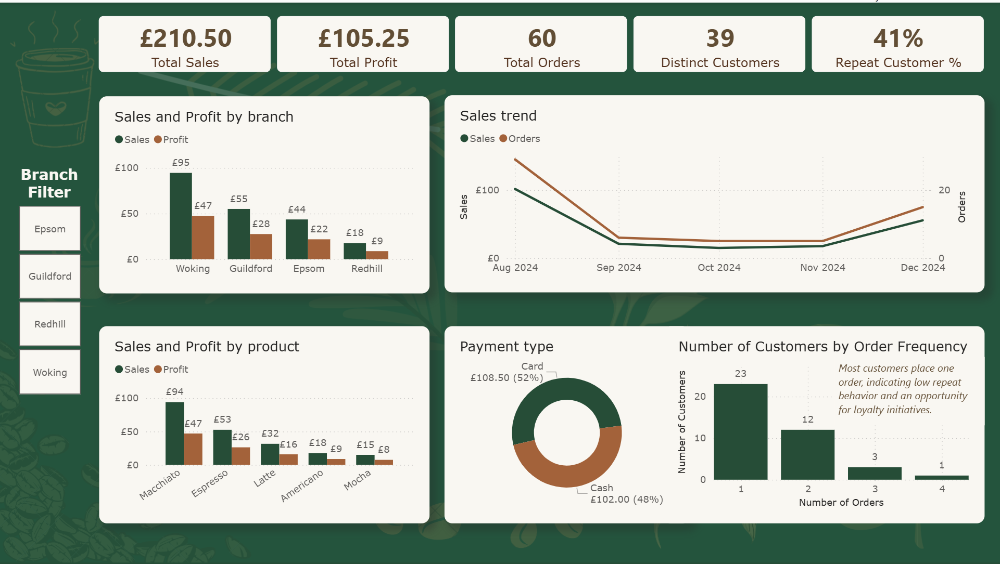

# ☕ Café Sales Performance Dashboard (Pilot Project)

## 1️⃣ Project Overview & Task Description

This project is a **pilot analytics solution** developed during my **Data Analytics Bootcamp at Generation UK** for a café business to visualise **sales performance, profitability, and customer buying behaviour** across branches.

The objective was to:
- Analyse **sales and profit by store**
- Understand **customer buying habits** (what is purchased and how often)
- Explore **payment methods**
- Ensure **early data anonymisation**
- Deliver a solution that is **scalable** for future expansion

Raw transaction data is provided as a **text file**, processed using Python, and presented through an **interactive Power BI dashboard**.

---

## 2️⃣ Tools Used & Design Decisions

### Python (ETL & Anonymisation)
### Why Python

- Enables early and explicit data anonymisation (removal of card numbers and personal identifiers)
- Provides a repeatable and scalable ETL process
- Allows business logic (profit calculation) to be applied before visualisation

### ETL pipeline:
- Ingest raw text data
- Remove sensitive data (card numbers)
- Anonymise customer names into `customer_id`
- Apply business logic (50% profit margin for café)
- Output a clean CSV for reporting

### 📊 Power BI (Dashboard & User Interface)
Power BI is used as the visualisation layer because it is:
- Interactive and business-friendly
- Suitable for a pilot and easy to scale for future use

Only **clean, anonymised data** is loaded into Power BI.

---

## 3️⃣ How to Run the Project

### Requirements
- Python 3.x
- Power BI Desktop

### Run ETL
From the project root directory:
```
bash
python etl.py 
```

This process read the raw café sales text file, clean and anonymise the data and generate clean dataset /cafe-clean-data.csv`.

### View Dashboard

1. Open the Power BI `visualisation.pbix` file  
2. Click **Refresh**  
3. Explore the dashboard using filters and interactive visuals  

---

## 4️⃣ Dashboard Overview & Insights



The dashboard is designed as a **single-page executive view** to support quick and informed decision-making.

### Key KPIs
- Total Sales  
- Total Profit  
- Total Orders  
- Distinct Customers  
- Repeat Customer %  

### Visuals Included
- **Sales and Profit by Branch** – compares performance across store locations  
- **Sales Over Time** – highlights trends and seasonality  
- **Sales and Profit by Product** – identifies best-performing items  
- **Payment Type Breakdown** – shows customer payment preferences  
- **Customer Order Frequency** – distinguishes one-time and repeat customers  

---

## 🔮 Future Scalability

If the pilot is successful, the solution can be extended to:
- Support more branches  
- Use a local or cloud-based database  
- Automate ETL execution  
- Deploy Power BI in a shared or cloud environment  

---

## 📌 Summary

This project demonstrates an end-to-end analytics workflow: raw data → anonymised ETL → business insights, with a focus on privacy, usability, and scalability.

